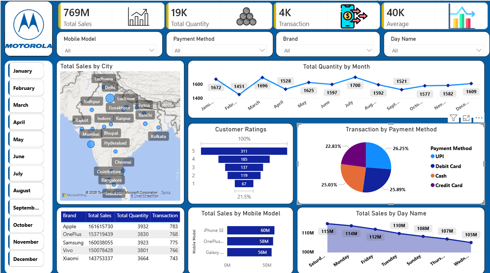
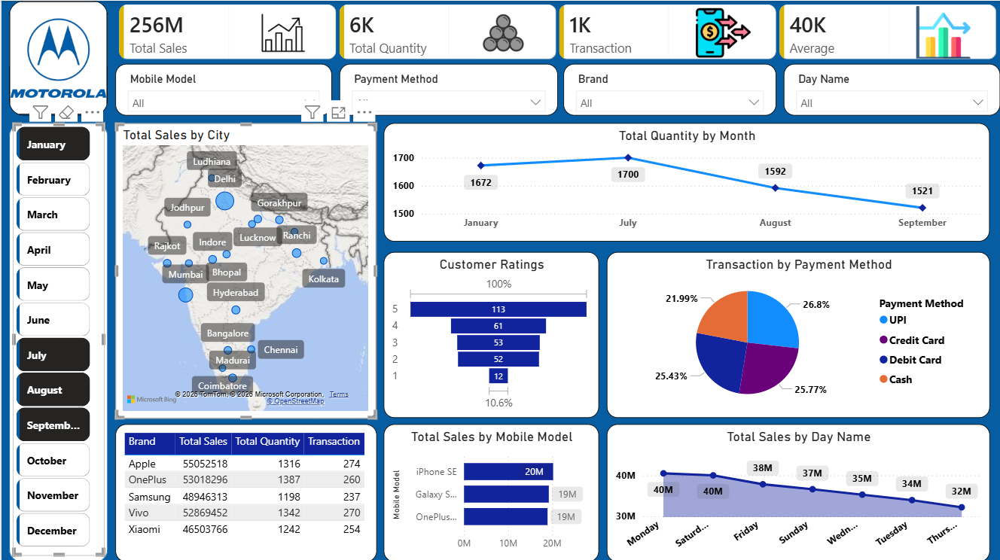
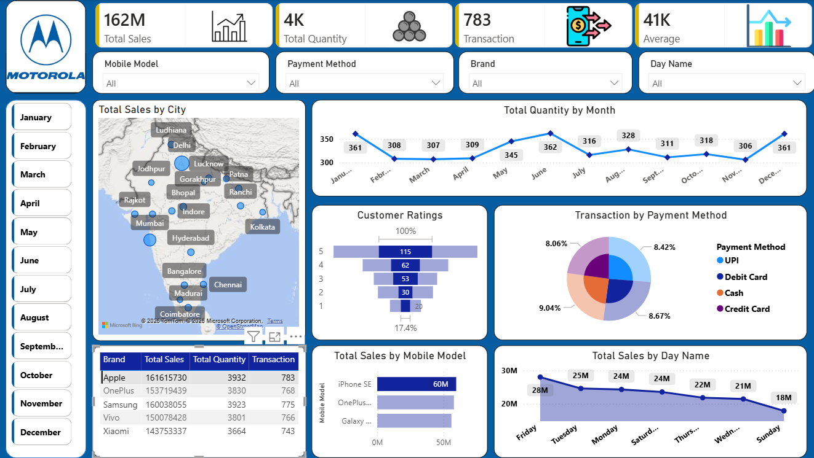

# Mobile Sales Performance Dashboard (Power BI)

## 📌 Project Overview
This interactive Power BI dashboard provides a comprehensive analysis of sales performance for a mobile retail business (focused on major brands like Motorola, Apple, Samsung, OnePlus, Vivo, and Xiaomi). It transforms raw sales data into actionable business insights, tracking key performance indicators (KPIs), monthly trends, regional distribution, and consumer preferences.

The dashboard is designed with a clean, modern user interface, featuring interactive slicers and smooth navigation to enable data-driven decision-making for stakeholders.

---

## 🛠️ Tech Stack & Tools Used
* **Data Visualization:** Power BI Desktop
* **Data Source:** Excel
* **Data Cleaning & Transformation:** Power Query
* **Key Concepts:** Data Modeling, DAX Measures, KPI Cards, Interactive Slicers, Custom Page Layouts.

---

## 📸 Dashboard Preview

### 1. Main Executive Dashboard

### 2. Motorola Performance Analysis (Filtered View)

### 3. Apple Premium Segment Analysis (Filtered View)

---

---

## 📊 Key Features & Insights Delivered

### 1. High-Level Executive KPIs (Top Bar)
* **Total Sales:** ₹769M (Gross revenue generated across all brands).
* **Total Quantity Sold:** 19K units distributed.
* **Total Transactions:** 4K successful orders.
* **Average Order Value:** ₹40K average transaction size.

### 2. Interactive Slicers & Filters
* **Top Filters:** Dynamic dropdowns for **Mobile Model, Payment Method, Brand, and Day Name** to drill down into specific data points.
* **Left Navigation Bar:** Month-wise quick filters from **January to December** for seamless time-period analysis.

### 3. Geographical Analysis (Total Sales by City)
* An interactive map visual highlighting sales concentration across major Indian hubs like **Delhi, Mumbai, Lucknow, Bhopal, Indore, Patna, Ranchi, Kolkata, Bangalore, and Chennai**, showcasing North and West regions as high-performing zones.

### 4. Sales Trends & Forecasting (Total Quantity by Month)
* A detailed Line Chart tracking the quantity sold month-over-month. It highlights seasonal peaks (e.g., **March with 1,696 units and July with 1,700 units**) and slight dips (e.g., February), helping with inventory planning.

### 5. Customer Satisfaction (Customer Ratings)
* A Funnel Chart displaying consumer ratings from 1 to 5 stars. The majority of ratings lie in the **4-star (185) and 5-star (311)** categories, indicating strong overall customer satisfaction.

### 6. Transaction Methods (Transaction by Payment Method)
* A Pie Chart analyzing consumer payment preferences, showing a highly balanced ecosystem:
  * **UPI:** 26.25% (Dominant payment mode)
  * **Credit Card:** 22.83%
  * **Debit Card:** 25.89%
  * **Cash:** 25.03%

### 7. Product & Weekly Performance
* **Total Sales by Mobile Model:** Bar chart identifying top revenue-generating models like iPhone SE ($60M), OnePlus ($58M), and Galaxy ($56M).
* **Total Sales by Day Name:** Area chart indicating that weekends (starting **Saturday with 115M** and Monday) bring in the highest revenue, which gradually decreases mid-week.

---

## 📂 How to Review the Project
1. Download the `.pbix` file from this repository.
2. Open it using **Power BI Desktop** and the **Excel dataset** from this repository.
3. Interact with the slicers on the left and top panels to explore the live cross-filtering capabilities.
